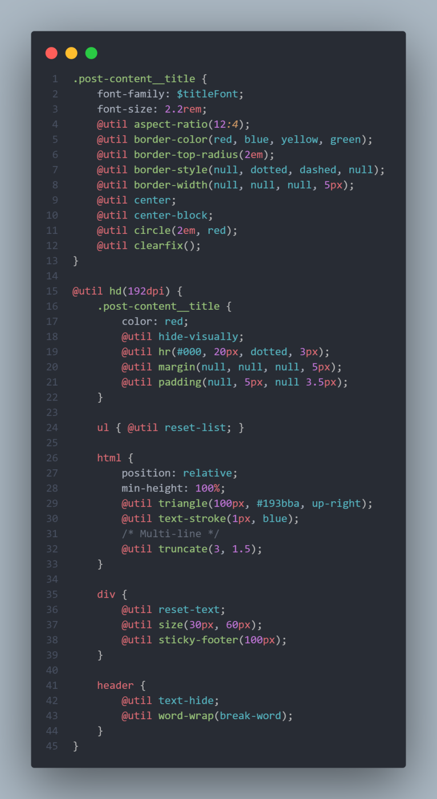

# [Cards-component]()
This is the seventh project from Juan Pablo's course of [CSS Grid and Flexbox](https://www.udemy.com/course/css-grid-y-flexbox-la-guia-definitiva-crea-10-proyectos/).

> **Note:** this is supposed to be the complement of the [Travel Blog](https://github.com/said-alrove/travel-blog) project (this should've been developed first, but due to I was rebuilding all the projects of this course without an apparent order I finished rebuilding the big one first, and just after, the mini-project that was supposed to be the base of it).

> **Disclaimer:** I'm starting to learn how to use **Git/Github** correctly, therefore there'll be plenty of pull requests, commits and other stuff as tests in this repository, however, *this won't represent my way of working forever*, I'll learn more things along the way as always :D!.

## Table of contents
* [What I learned](#what-i-learned)
* [Lectures](#lectures)
* [Preview](#preview)
* [Reports](#reports)
    - [GTmetrix](#gtmetrix)
    - [Lighthouse](#lighthouse)
* [Open Graph](#open-graph)
    - [Facebook](#facebook)
    - [Twitter](#twitter)

## **What I learned** 🎨
* First, I'd like to say that the purpose of this mini-project was to learn more about PostCSS plugins. I already know how to use them, but nothing special out of [**autoprefixer**](https://www.npmjs.com/package/autoprefixer) and [**cssnano**](https://www.npmjs.com/package/cssnano), therefore this time I wanted to leave my usual preprocessor (**SASS**) beside and instead, use all the possible and interesting features PostCSS plugins could offer me. These are some of the plugins I'm using for this project: 
    - [doiuse](https://www.npmjs.com/package/doiuse) is meant to be a debugger for non-supported features (this is based on your own preferences, in my case, I set the warnings for features not supported by browsers with more than 1% of global use). It warns you in the console about things that may cause problems in some browsers.
    - [postcss-import](https://www.npmjs.com/package/postcss-import) is meant to be a plugin that allows you to use the **import** at-rule in your stylesheets as you'd normally do it in SASS.
    - [postcss-simple-vars](https://www.npmjs.com/package/postcss-simple-vars) is meant to be a plugin that allows you to create sass-like variables in your stylesheets.
    - [postcss-atroot](https://www.npmjs.com/package/postcss-atroot) is meant to be a plugin that allows you to use the **at-root** at-rule in your stylesheets as you'd normally do it in SASS.
    - [postcss-utilities](https://www.npmjs.com/package/postcss-utilities) is meant to be a plugin that allows you to use useful utilities with the **util** at-rule (as in TailwindCSS).
    - [postcss-define-property](https://www.npmjs.com/package/postcss-define-property) is meant to be a plugin that allows you to create sort of shortcuts for different properties in just one property.
    - [postcss-short-spacing](https://www.npmjs.com/package/postcss-short-spacing) is meant to be a plugins that allows you to omit sides within **margin** and **padding** properties in CSS.
    - [postcss-short-position](https://www.npmjs.com/package/postcss-short-position) is meant to be a plugins that allows you to define sides within the **position** property in CSS.
    - [postcss-short-color](https://www.npmjs.com/package/postcss-short-color) is meant to be a plugin that allows you to define **background-color** within the **color** property in CSS.
    - [postcss-responsive-font](https://www.npmjs.com/package/postcss-responsive-font) is meant to be a plugin that helps you to create responsive fonts (as you might have guessed), it allows you to use a new property called **font-size-responsive** which accepts four values, the minimum and the maximum font-size and the minimum and maximum viewport-width.
    - [postcss-map](https://www.npmjs.com/package/postcss) is meant to be a plugin that allows you to create maps to save values (such as in SASS), but in a more modular way (by creating files with the **.yml** extension) and then using them in your stylesheets through the **map** function (again, such as in SASS).
    - [postcss-sassy-mixins](https://www.npmjs.com/package/postcss-sassy-mixins) is meant to be a plugins that allows you to use sass-like mixins in your stylesheets.
    - [postcss-nested] is meant to be a plugins that allows you to use the power of nesting within your stylesheets such as in SASS.
    - [postcss-nested-vars](https://www.npmjs.com/package/postcss-nested-vars) is meant to be a plugin that allows you to create **global and local scopes** for your variables such as in SASS.
    - [postcss-proportional-spacing](https://www.npmjs.com/package/postcss-proportional-spacing) is meant ot be a plugin that allows you to create vertical and horizontal proportional spacing using ratios.

* Something important to mention is that for this mini-project I wanted to use PostCSS plugins only, to test which ones are worth it to use in future projects in combination with **SASS** to make a stronger kind of preprocessor.

    - While compiling I figured out that there were some features that seem to don't be supported by PostCSS (or any of the plugins I used), being two of those the **::before** and **::after** pseudo-elements.
    -Also, I had problems when trying to use the parent selector in my styles (it doesn't work as in SASS, is more complicated and less cool).
    
* To make things more interesting, I tried to use Javascript and JSON as I did in the [**freelancer-home**](https://github.com/said-alrove/freelancer-home) project to load data, in this case, the data of the cards component, and it worked perfectly!, I'll try to learn more about JSON and Javascript (at least the basics) while rebuilding the projects that are left to me (remember that I'm rebuilding all my portfolio of projects to make them more presentable and actualized) to use them there, this way I can be more comfortable with those technologies before even starting to learn them in deep.

* This time I wanted to put more into practice the use of responsive properties for images in HTML such as **srcset** and **sizes**, therefore I read an [article](https://medium.com/@MRWwebDesign/responsive-images-the-sizes-attribute-and-unexpected-image-sizes-882a2eadb6db) about the topic and I rewatched the series of videos about [The images on the Web](https://youtube.com/playlist?list=PLssXrSIRXL82LDiv1wLFhknwhlG_LH0VI) of [**Kevin Powell**](https://www.youtube.com/kepowob/featured) (I had already watched this a long time ago, but there were some things I didn't remember as well as I'd like, therefore I decided to refresh my memory).

* Because I was also going to focus this mini-project on the images, I decided to put attention on the **alt** attribute as well by reading more information about its use (there were certain projects where I used the "This image shows" sentence which seems to be wrong, therefore I wanted to get more information about how to optimize the alternative text content).

> **Note:** While looking for information about the images on the web and the alternative text attribute I saw how a couple of authors mentioned the importance of accessibility for videos and audios which's also very important, thus I decided to put it into practice for those specific cases in a future project (which will help me also to learn how to set up the **video** and **audio** tags correctly in the HTML file).

* Also, I learned the [@util PostCSS library](https://ismamz.github.io/postcss-utilities/docs) (it's a small utilities library), first, because I had to (is one of the plugins I set for PostCSS, therefore would have been quite weird to don't use it) and second, because I wanted to get used to this **utlities** model using the @util rule (which is also used for injecting [TailwindCSS](https://tailwindcss.com/docs/installation) utilities into our stylesheets, obviously the main point of TailwindCSS is to avoid spending too much time writing CSS and instead, just write HTML "inline-styles", but you get it, I wanted to be more in line with it for when I learn it). Here are some screenshots about all the utilities available with @util (this is how I practiced with it before getting full into the project):

> **Note:** I made notes about some issues that I ran into when testing these utilities, but I removed them when taking the screenshot basically because **Snapshot** seems to didn't understand break-lines which is bad when having large comments.

## **Lectures** 📚
- [Some things you may think about PostCSS... and you might be wrong](https://www.julian.io/articles/postcss.html)
- [Responsive Images, The sizes Attribute, and Unexpected Image Sizes](https://medium.com/@MRWwebDesign/responsive-images-the-sizes-attribute-and-unexpected-image-sizes-882a2eadb6db)
- [It’s ALT Good: Alternative Text & Accessibility](https://mrwweb.com/alternative-text-accessibility/)

## **Preview** 👩‍💻

## **Reports** 🎯

### GTmetrix

### Lighthouse

## Open Graph

### Facebook

### Twitter
